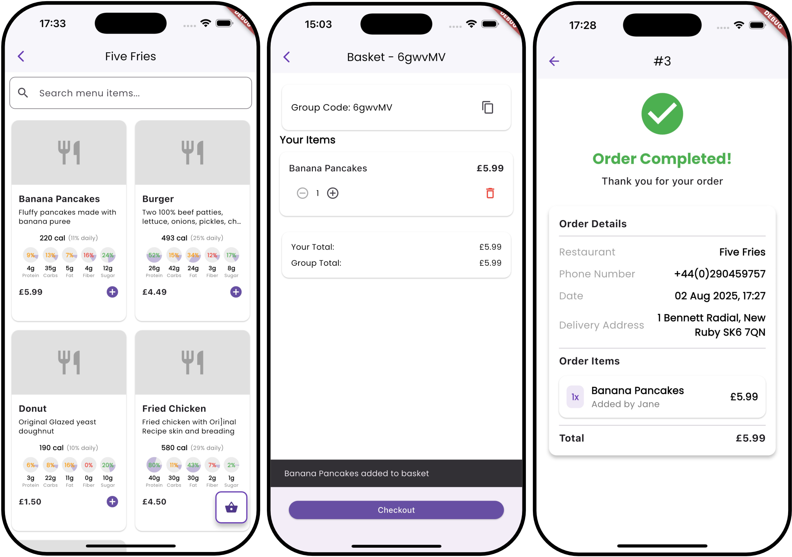
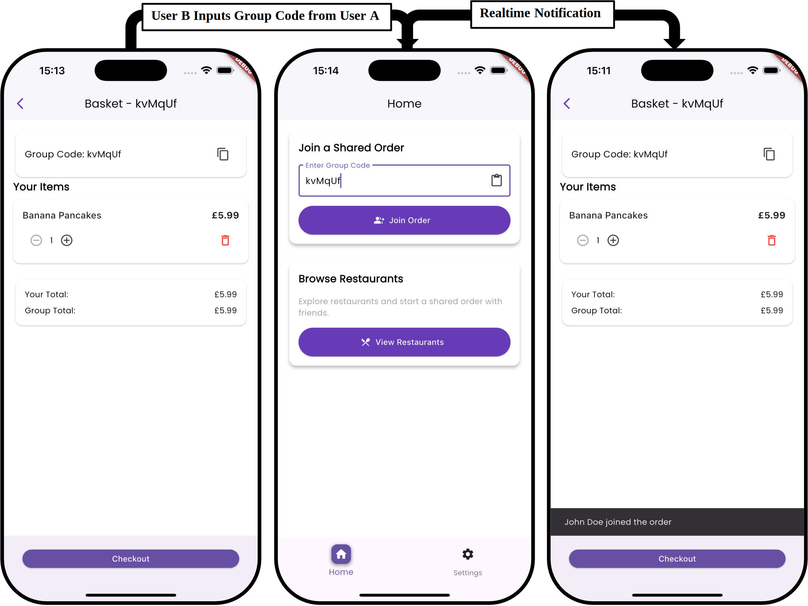
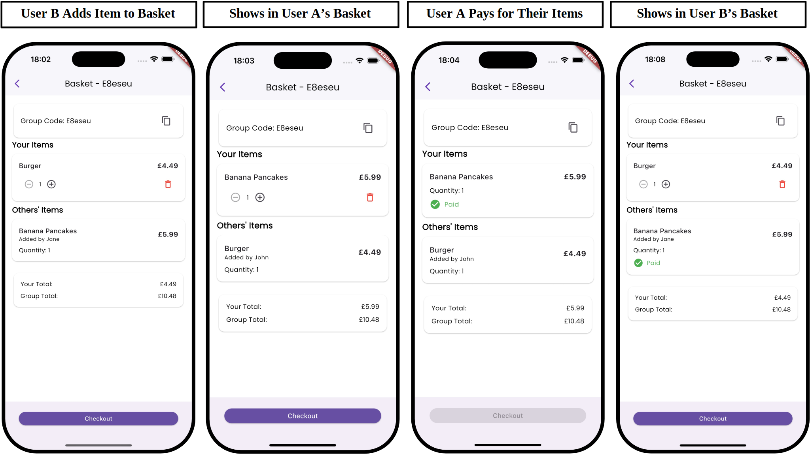

## Overview
Picture this: You and your friends are hangry, ready to conquer the world of takeout. But then, the dreaded "Who's ordering?" question pops up. Suddenly, you're drowning in a sea of screenshots, cryptic messages, and desperately trying to track down who owes what. By the time you have figured it all out, the pizza's cold (or never even got ordered!). Well, say goodbye to that chaos because DeliverTwo is here to revolutionise your experience! 

## The Ingredients
At its core, DeliverTwo is all about collaboration. No more one person footing the entire bill! Here is a rundown on its superpowers:

- Real-time Shared Baskets: Imagine everyone adding their items to the same basket, seeing updates instantly! No more frantic screenshots or confusing group chats.
- Individual Payments: This is a game-changer! Everyone pays for their own items directly, eliminating the need for awkward IOUs and bank transfers. Your friendships (and bank accounts) will thank you.
- Nutritional Nudges: Want to make healthier choices? DeliverTwo offers nutritional information for individual items. It's not about being a killjoy, but empowering you to be mindful of what you're eating.
- Intuitive & Familiar: The app's design takes cues from popular food delivery apps you already know and love. This means less head-scratching and more deliciousness! 

## The Recipe
- Flutter for a Smooth Ride: The app's frontend is built with Flutter, a Google-backed framework that ensures a consistent and zippy experience whether you're on an iPhone or an Android device. It’s all about speed and efficiency! 
- Laravel on the Backend: The Brains of the Operation: The app's "brain" is built with Laravel, a robust PHP framework. It handles everything from user accounts to restaurant menus, making sure everything runs like a well-oiled machine.
- WebSockets for Instant Updates: This is where the magic of real-time collaboration happens! WebSockets create a persistent connection between your app and the server, meaning those basket updates and payment statuses appear instantly, without you even having to refresh. It's like having a direct line to your friends' orders!
- Postgres for Rock-Solid Data: All your order details, user info, and menu items are stored securely in a PostgreSQL database. It's chosen for its reliability and ability to handle all those complex relationships (like who ordered what in which group!).
- CI/CD Pipeline: Quality from the Get-Go: To ensure the app is always in top shape, DeliverTwo uses a fancy "CI/CD pipeline" with GitHub Actions and Docker. This basically means that every time a developer makes a change, the system automatically builds and tests the app to catch any issues early on, ensuring a smooth and bug-free experience for you.

## The Main Event
### Main Pages

### Joining A Basket

### Adding Items To A Basket

## Room for Dessert?

Even great apps can get better! DeliverTwo is already thinking about exciting future improvements to make your ordering experience even more fantastic:

- Smarter Security & Scalability: Implementing even stronger unique identifiers (UUIDs) for orders, adding rate limiting to protect the API, and considering admin controls for better order management.
- Personalized Recommendations: Imagine the app suggesting dishes you'll love based on your past orders! This could be a fantastic addition to boost user engagement.
- Supercharged Code Maintenance: Moving to a more advanced state management system like Riverpod to make the app's code even cleaner and easier to maintain, leading to smoother updates and new features down the line.
- Even Faster Performance: Further implementation of caching will help deliver API responses at lightning speed!
